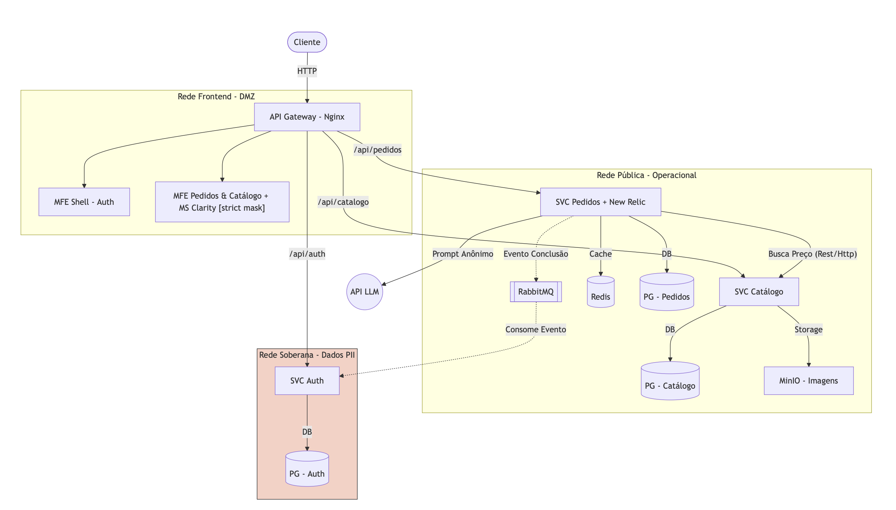

# Plataforma de Gestão de Pedidos Internos (PR-CGSE)

Este projeto é uma plataforma distribuída, segura e observável para a gestão de pedidos internos, desenvolvida com foco em **Privacidade por Design (LGPD)** e **Nuvem Soberana**.



---

## Arquitetura e Segurança (Privacy by Design)

O sistema implementa uma topologia de **três redes isoladas** no Docker, garantindo que dados sensíveis nunca toquem a internet diretamente:

1.  **DMZ / Rede Frontend**: Contém os Microfrontends (React) e o API Gateway (Nginx). É a única camada com porta exposta (8080).
2.  **Nuvem Pública (Operacional)**: Contém o `svc-catalogo`, `svc-pedidos`, Redis e MinIO. Opera fluxos de negócio usando apenas **UUIDs anônimos**.
3.  **Nuvem Soberana (Isolada)**: Contém o `svc-auth` e o banco de usuários (PII). É uma rede `internal: true` sem rota para a internet, acessível apenas via Gateway para autenticação.

---

## Tecnologias e Bibliotecas

### Backend (Python / FastAPI)
- **FastAPI**: Framework de alta performance com tipagem estática.
- **SQLAlchemy & Pydantic**: ORM e validação de dados (Fail-fast).
- **Pika & RabbitMQ**: Mensageria assíncrona para notificações.
- **Redis**: Camada de cache distribuído para pedidos.
- **Httpx**: Comunicação síncrona entre microsserviços.
- **MinIO**: Storage de objetos compatível com S3 para imagens do catálogo.
- **Gemini 2.5 Flash**: IA generativa para classificação automática de risco de pedidos.

### Frontend (React / Vite)
- **React 19 & Vite**: Stack moderna para interfaces rápidas.
- **Module Federation**: Arquitetura de Microfrontends (Shell + Remote).
- **@govbr-ds/core**: Design System oficial do Governo Federal Brasileiro.
- **Vitest & React Testing Library**: Testes unitários e de componentes.
- **Microsoft Clarity**: Monitoramento de UX com *Strict Masking* para conformidade LGPD.

### Observabilidade
- **New Relic**: Monitoramento de performance (APM) e infraestrutura.
- **Nginx API Gateway**: Centralização de rotas, load balancing e segurança.

---

## Documentação da API (Endpoints)

Todas as requisições devem passar pelo Gateway (`http://localhost:8080`).

### Autenticação (`/api/auth`)
| Método | Endpoint | Descrição |
| :--- | :--- | :--- |
| `POST` | `/register` | Cadastro de usuário (Primeiro = ADMIN). |
| `POST` | `/login` | Autenticação e emissão de JWT. |

### Gestão de Pedidos (`/api/pedidos`)
*Requer JWT (exceto rotas internas).*

| Método | Endpoint | Descrição |
| :--- | :--- | :--- |
| `GET` | `/` | Lista pedidos do usuário logado. |
| `POST` | `/` | Cria novo pedido (Trigger IA Risk Analysis). |
| `GET` | `/{id}` | Detalhes do pedido (Cacheado no Redis). |
| `PUT` | `/{id}` | Atualiza pedido e reavalia risco. |
| `DELETE` | `/{id}` | Cancela pedido e notifica via RabbitMQ. |
| `GET` | `/check-produto/{id}` | [Interno] Verifica se produto está em algum pedido. |

### Catálogo de Produtos (`/api/catalogo`)
| Método | Endpoint | Descrição |
| :--- | :--- | :--- |
| `GET` | `/produtos` | Lista catálogo de bens. |
| `POST` | `/produtos` | Cadastra novo produto (ADMIN). |
| `PUT` | `/produtos/{id}` | Atualiza dados do produto (ADMIN). |
| `DELETE` | `/produtos/{id}` | Remove produto se não houver pedidos (ADMIN). |
| `POST` | `/produtos/{id}/imagem` | Upload de imagem para o MinIO. |

---

## Como Executar

1. **Configuração**: Copie o `.env.example` para `.env` e preencha as chaves da Google AI e New Relic.
2. **Subir a Stack**:
   ```bash
   docker compose up -d --build
   ```
3. **Seed de Dados**: O banco do catálogo é populado automaticamente no primeiro boot.

---

## Testes

O projeto utiliza **SQLite em memória** para garantir testes rápidos, isolados e determinísticos.

```bash
# Backend (exemplo)
docker compose exec svc-pedidos pytest

# Frontend (exemplo)
cd mfe-pedidos && npm test
```

---

## Trade-offs e Decisões
- **RabbitMQ vs Kafka**: Optou-se pelo RabbitMQ por ser mais leve e adequado para notificações unitárias (AMQP).
- **Nginx Gateway**: Utilizado como um API Gateway leve em vez de um BFF customizado para reduzir a latência e complexidade.
- **SQLite nos Testes**: Escolhido para agilizar o pipeline de CI/CD sem sacrificar a integridade das regras de negócio.
- **Replica e Healthcheck**: Usa replicas e healthchecks para garantir a disponibilidade dos serviços e simulando um ambiente e recursos com k8s.